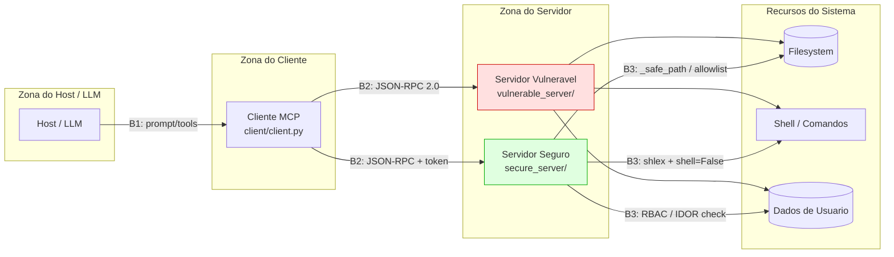

# 🏗️ Arquitetura do Lab e Trust Boundaries

⚠️ Material educacional.

O diagrama mostra o fluxo MCP (Host/LLM → Cliente → Servidor → Recursos) e as
três fronteiras de confiança (B1, B2, B3), com os ataques e defesas em cada uma.

## Trust boundaries

- **B1 — Host/LLM ↔ Cliente**: superfície de prompt injection (#9) e tool
  poisoning (#6). Defesa: sanitizar descrições e não expor prompts inseguros.
- **B2 — Cliente ↔ Servidor**: superfície de falta de autenticação (#4).
  Defesa: token HMAC obrigatório em toda chamada + RBAC (#5).
- **B3 — Servidor ↔ Recursos**: superfície de path traversal (#2), command
  injection (#3), IDOR (#7) e exposição de recursos (#8). Defesa: `_safe_path`,
  `shlex`+`shell=False`+allowlist, verificação de identidade e escopo explícito.

## Como ler o contraste

- O **servidor vulnerável** acessa Filesystem, Shell e Dados sem qualquer
  controle nas fronteiras.
- O **servidor seguro** aplica um controle específico em cada aresta B3, além de
  exigir autenticação em B2.
